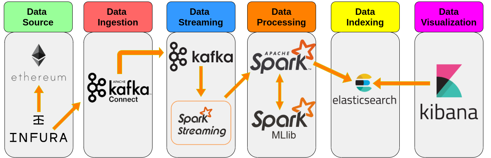

# TapEth

TapEth (**T**echnologies for **A**dvanced **P**rogramming - **ETH**ereum) is a university project.
The main goal of this project is to statistically analyze pending transaction on one [Ethereum](https://ethereum.org/) network (e.g. the main network) to predict the estimated waiting time for each transaction before being mined in a block.

**N.B.** Some large files, like Kafka or Spark packages, are hosted in GitHub using **git-lfs**.

### Technologies used

The **data pipeline** is composed of the following steps:
| Step | Technology used |
| :---- | :---------------: |
| **Data ingestion** | [Apache Kafka Connect](https://kafka.apache.org/documentation.html#connect) |
| **Data streaming** | [Apache Kafka](https://kafka.apache.org/) / [Apache Spark Streaming](https://spark.apache.org/streaming/) |
| **Data processing** | [Apache Spark](https://spark.apache.org/) / [Apache Spark MLlib](https://spark.apache.org/mllib/) |
| **Data indexing** | [ElasticSearch](https://www.elastic.co/) |
| **Data visualization** | [Kibana](https://www.elastic.co/kibana) |

 

## How TapEth works

The estimation is based on the gas price of the pending transaction. The gas price represent how much the user is disposed to spent for the transaction, so higher values of gas price are more catchy for miners that will mine the transaction sooner.   
TapEth uses [Infura](https://infura.io) that basically is service that provides a [geth](https://geth.ethereum.org/) node (exposing the [Ethereum JSON-RPC api](https://eth.wiki/json-rpc/API)). Through the pub/sub pattern, using the JSON-RPC api and **websockets**, it's possibile to subscribe to events like new blocks mined or incoming pending transactions; for more information, visit the [pub/sub documentation](https://geth.ethereum.org/docs/rpc/pubsub) of geth.

In brief:
1. Pending transactions are acquired from Kafka Connector and written to a Kafka Topic. For more information, visit the [Kafka section](./Kafka/README.md) of this project.
2. Spark Streaming reads from the Kafka Topic, then Spark MLlib processes the incoming data using machine learning and lastly sends the data to ElasticSearch. For more information, visit the [Spark section](./Spark/README.md) of this project.
3. Finally Kibana reads indexes from ElasticSearch and exposes a beautiful graphical interface.

## How to start TapEth

You can start it easily with **docker-compose** using `docker-compose up` from the root of this project folder.